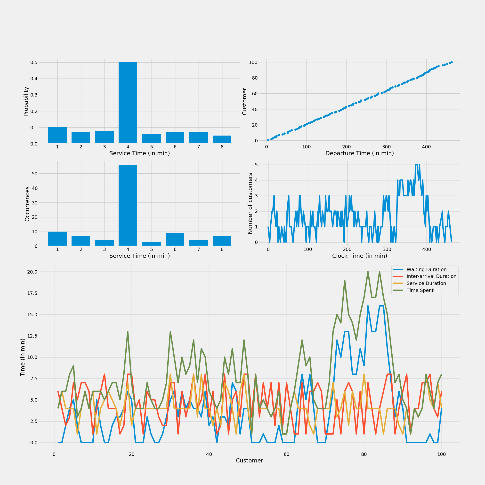

# Lab 1
## Single Queueing System

    
   

### Contents
- [Problem](#problem)
    - [Questions](#questions)
- [Solution](#solution)
    - [Data Visualization](#data-visualization)

## Problem
A bank has only one checkout counter. Customers arrive at this checkout counter at random from 1 to 8 minutes apart.

Each possible value of inter-arrival time has the same probability of occurrence. The service times vary from 1 to 8 minutes with probabilities shown in the table.

*The problem is to analyze the system by simulating the arrival and service of first 100 customers.*

| Service Time (in min) | Probability |
|:---------------------:|:-----------:|
|           1           |     0.10    |
|           2           |     0.07    |
|           3           |     0.08    |
|           4           |     0.50    |
|           5           |     0.06    |
|           6           |     0.07    |
|           7           |     0.07    |
|           8           |     0.05    |

### Questions

Calculate the following:

- The average waiting time for a customer
- The probability that a customer has to wait in the queue
- The fraction of idle time of the server
- The average service time
- The average time between arrivals
- The average waiting time of those who wait
- The average time a customer spends in the system

| Random digits for arrival | Random digits for service time |
|:-------------------------:|:------------------------------:|
|            913            |                84              |
|            727            |                10              |
|             15            |                74              |
|            948            |                53              |
|            309            |                17              |
|            922            |                79              |
|            413            |                45              |
|             20            |                98              |

## Solution

```
 python customer_simulation.py [--cust] <number of customers to simulate> [--table]
```

**Options:**
* **`-c --cust`**: Number of customers to simulate [default: 100]
* **`-t --table`**: Simulate 8 customers using the random number table

**Note:**
- The final solutions are printed in the console.
- The events of all customers are logged in **`eventlog.txt`**.

### Data Visualization

The statistical data visualizations are plotted in **`data_viz.png`** which contains the following graphs:
- Service Time (in min) vs Probability
- Service Time (in min) vs Number of generated occurrences
- Departure Time (in min) vs Customer
- Clock Time (in min) vs Number of customers in queue
- Customer vs:
    - Waiting duration
    - Inter-arrival duration
    - Service duration
    - Time spent in system

For simulation of a 100 customers with 0 seed, the following data is obtained:

