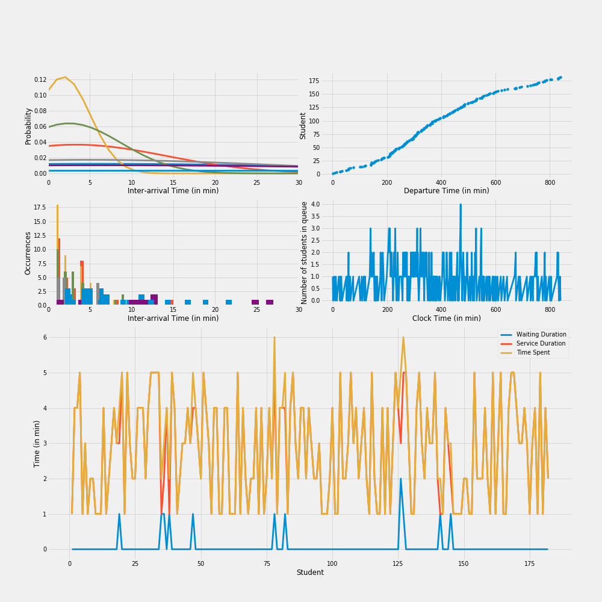

# Lab 2
## Multiple Counter Queueing System

    
   

### Contents
- [Problem](#problem)
    - [Questions](#questions)
- [Solution](#solution)
    - [Data Visualization](#data-visualization)

## Problem
At a college library the following situation exists:
- The library remains open from 8 AM to 10 PM.
- There are two counters for issuing books to students.
- The students arrive for taking out books according to the **Poisson distribution**, but their arrival rate changes every two hours as follows:

    |  Hours  | Avg. Inter-arrival Time (in min) |
    |:-------:|:--------------------------------:|
    |   8-10  |               5.7                |
    |  10-12  |               3.3                |
    |  12-14  |               1.8                |
    |  14-16  |               2.5                |
    |  16-18  |               4.8                |
    |  18-20  |               6.2                |
    |  20-22  |              10.7                |

- The check out time (service time) varies uniformly from 1 minute to 5 minutes per student depending on the individual student and the number of books he wants to take out.

*The problem is to simulate the system for 100 days.*

### Questions

Calculate the following:

- Maximum queue length
- Average length
- Total idle time

## Solution
If  is the number of arrivals in a fixed interval of time of length , then  has the Poisson distribution:

=\frac{e^{-\lambda&space;t}\cdot(\lambda&space;t)^k}{k!})

and the time between successive arrivals (inter-arrival times) are exponentially distributed. Hence, the mean inter-arrival times act as the mean  for the exponential distributions. Thus:


```
 python library_simulation.py [--days] <number of days to simulate> [--counters] <number of counters in library>
```

**Options:**
* **`-d --days`**: Number of days to simulate [default: 100]
* **`-cnt --counters`**: Number of counters in library [default: 2]

**Note:**
- The final solutions are printed in the console.
- The events of all students for each day are logged in **`logs/eventlog_day_*.txt`**.

### Data Visualization

The statistical data visualizations of each day are plotted in **`img/data_viz_day_*.png`** which contains the following graphs:
- Inter-arrival Time (in min) vs Probability of all slots
- Inter-arrival Time (in min) vs Number of generated occurrences
- Departure Time (in min) vs Customer
- Clock Time (in min) vs Number of customers in queue
- Customer vs:
    - Waiting duration
    - Service duration
    - Time spent in system

For simulation of the library with 0 seed, the following data is obtained for the first day:

